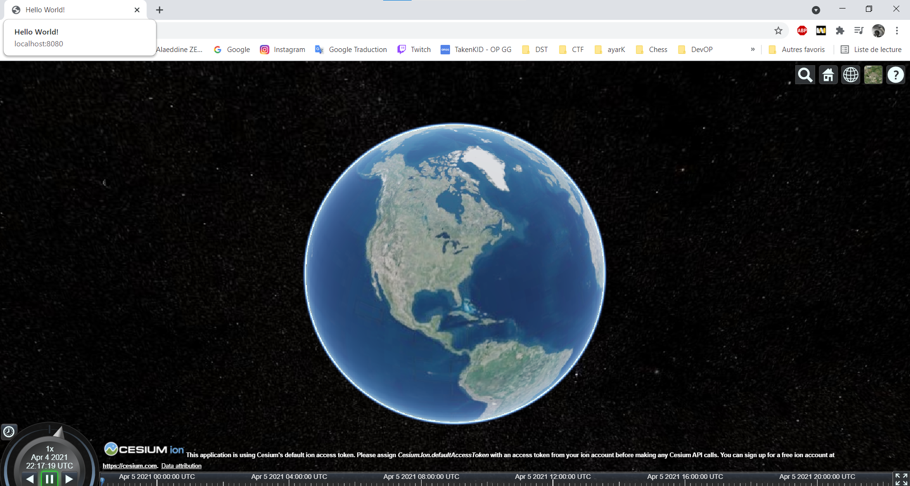

# CesiumJS et Webpack
Webpack est un outil populaire et puissant pour regrouper des modules JavaScript. Il permet aux développeurs de structurer leur code et 
leurs actifs de manière intuitive et de charger différents types de fichiers selon les besoins avec des `require` instructions simples.

Dans une première partie, on va créer une application Web simple à partir de zéro à l'aide de webpack, puis couvrir les étapes pour intégrer le module Cesium npm .

## Créer une application Webpack de base

Créez un nouveau `cesium-webpack` répertoire pour votre application. Ouvrez une console, accédez au nouveau répertoire et exécutez la commande suivante :
```
npm init
```
Suivez les invites et indiquez les détails de votre application. Appuyez sur `Entrée`pour utiliser les valeurs par défaut. Cela créera package.json.
## Créez le code de l'application
Créez un ```src``` répertoire pour le code de notre application. Lorsque nous construisons l'application, webpack produira des fichiers de distribution dans un ```dist``` répertoire.

Créez src/index.htmlet ajoutez du code pour une page HTML standard.
```html
<!DOCTYPE html>
<html lang="en">
  <head>
    <meta charset="utf-8">
    <meta http-equiv="X-UA-Compatible" content="IE=edge">
    <meta name="viewport"
      content="width=device-width, initial-scale=1, maximum-scale=1, minimum-scale=1, user-scalable=no">
    <title>Application de Base</title>
  </head>
  <body>
    <p>Hello World!</p>
  </body>
</html>
```

Créez ```src/index.js``` et ajoutez ce code de texte.

```javascript
console.log('Hello World!');
```
## Installer et configurer Webpack
Commencez par installer webpack en mode developpement (```--save-dev```).
```
npm install --save-dev webpack
```
### Configuration
Créez ```webpack.config.js```pour définir notre objet de configuration Webpack.

```javascript
const path = require('path');

const webpack = require('webpack');

module.exports = {
    context: __dirname,
    entry: {
        app: './src/index.js'
    },
    output: {
        filename: '[name].js',
        path: path.resolve(__dirname, 'dist'),
    }
};
```

`context`spécifie le chemin de base des fichiers.
`entry`est utilisé pour spécifier des bundles.
### Loaders
webpack charge tout comme un module. Utilisez des loaders pour charger dans CSS et d'autres fichiers d'actifs. Installez le `style-loader`, `css-loader`et `url-loader`.

`npm install --save-dev style-loader css-loader url-loader`

Ajoutez deux `module.rules` à webpack.config.js: un pour les fichiers CSS et un pour les autres fichiers statiques.
Définissez dans `test` les types de fichiers à charger et `use` spécifiez la liste des chargeurs.

on peut a titre d'exemple ajouter |geojson|topojson|kml... dans `test` si on veut importer ce type de fichier par la suite dans notre script.
```javascript
const path = require('path');

const webpack = require('webpack');

module.exports = {
    context: __dirname,
    entry: {
        app: './src/index.js'
    },
    output: {
        filename: '[name].js',
        path: path.resolve(__dirname, 'dist'),
    },
    module: {
        rules: [{
            test: /\.css$/,
            use: [ 'style-loader', 'css-loader' ]
        }, {
            test: /\.(png|gif|jpg|jpeg|svg|xml|json)$/,
            use: [ 'url-loader' ]
        }]
    }
};
```
### Plugins
Pour définir `index.html` et injectez notre bundle dans cette page on utilise un plugin webpack appelé html-webpack-plugin.
```
npm install --save-dev html-webpack-plugin
```
Exigez le plugin `webpack.config.js`et ajoutez-le à plugins. Passez `src/index.html`comme notre `template`.
```javascript
const path = require('path');

const webpack = require('webpack');
const HtmlWebpackPlugin = require('html-webpack-plugin');

module.exports = {
    context: __dirname,
    entry: {
        app: './src/index.js'
    },
    output: {
        filename: '[name].js',
        path: path.resolve(__dirname, 'dist'),
    },
    module: {
        rules: [{
            test: /\.css$/,
            use: [ 'style-loader', 'css-loader' ]
        }, {
            test: /\.(png|gif|jpg|jpeg|svg|xml|json)$/,
            use: [ 'url-loader' ]
        }]
    },
    plugins: [
        new HtmlWebpackPlugin({
            template: 'src/index.html'
        })
    ]
};
```
### Regroupez l'application & Exécutez le serveur de développement

Utilisez le `webpack-dev-server` pour servir une version de développement et voir notre application en action.
```
npm install --save-dev webpack-dev-server
```
Utilisez `package.json`pour définir des scripts avec lesquels nous pouvons appeler npm. Ajoutez la `build`commande.
Et ajoutez un `start`script à `package.json`pour exécuter le serveur de développement. 
(Remplacer `Scripts`deja existant)
```
  "scripts": {
    "build": "node_modules/.bin/webpack --config webpack.config.js",
    "start": "node_modules/.bin/webpack serve --config webpack.config.js --open"
}
```
Dites au serveur de développement de servir les fichiers du `dist`dossier. Ajoutez ceci au bas de `webpack.config.js`.
```js
    devServer: {
        contentBase: path.join(__dirname, "dist")
    }
```

Enfin, nous pouvons exécuter l'application!
```
npm start
```
Accepter l'installation de 'webpack-cli' si le vous êtes demandé.

Vous devriez voir votre contenu diffusé sur localhost:8080, et vous devriez voir le message "Hello World!" message lorsque vous ouvrez la console du navigateur.
## Ajouter CesiumJS à une application Webpack
### Installez CesiumJS
Installez le `cesium`module à partir de npm pour l'ajouter à `package.json`.
```
npm install --save-dev cesium
```
### Configurer CesiumJS dans le webpack
Ajoutez ce qui suit en haut de `webpack.config.js`:
```js
// The path to the CesiumJS source code
const cesiumSource = 'node_modules/cesium/Source';
const cesiumWorkers = '../Build/Cesium/Workers';
```
Ajoutez les options suivantes à l'objet de configuration pour résoudre certaines bizarreries avec la façon dont webpack compile CesiumJS.
```js
output: {
        filename: '[name].js',
        path: path.resolve(__dirname, 'dist'),
        // Needed to compile multiline strings in Cesium
        sourcePrefix: ''
    },
    amd: {
        // Enable webpack-friendly use of require in Cesium
        toUrlUndefined: true
    },

    resolve: {
        fallback: {
            fs: false
        },
        alias: {
            // CesiumJS module name
            cesium: path.resolve(__dirname, cesiumSource)
        }
    },
```

### Gérer les fichiers statiques CesiumJS

Enfin, assurez-vous que les fichiers d'actif, de widget et de travail Web CesiumJS statiques sont servis et chargés correctement.

Utilisez le ``copy-webpack-plugin``pour copier des fichiers statiques dans le `dist`répertoire dans le cadre du processus de génération.
```
npm install --save-dev copy-webpack-plugin
```
Exigez-le vers le haut de notre `webpack.config.js`fichier.
```js
const CopywebpackPlugin = require('copy-webpack-plugin');
```
Ajoutez ce qui suit au `plugins`tableau et définissez une variable d'environnement qui indique à CesiumJS l'URL de base pour le chargement des fichiers statiques à l'aide du webpack `DefinePlugin`. Le `plugins`tableau ressemblera maintenant à ceci:

```js
    plugins: [
        new HtmlWebpackPlugin({
            template: 'src/index.html'
        }),
        // Copy Cesium Assets, Widgets, and Workers to a static directory
        new CopywebpackPlugin({ 
            patterns: [
                { from: path.join(cesiumSource, cesiumWorkers), to: 'Workers' },
                { from: path.join(cesiumSource, 'Assets'), to: 'Assets' },
                { from: path.join(cesiumSource, 'Widgets'), to: 'Widgets' }
            ]
        }),
        new webpack.DefinePlugin({
            // Define relative base path in cesium for loading assets
            CESIUM_BASE_URL: JSON.stringify('')
        })
    ],
```
Cela permet la copie de `Assets`et `Widgets`répertoires, et les scripts construits (built scripts).
## Hello Cesium!
Créez un nouveau fichier `src/css/main.css`, pour styliser notre application:
```css
html, body, #cesiumContainer {
    width: 100%;
    height: 100%;
    margin: 0;
    padding: 0;
    overflow: hidden;
}
```

Créez un div pour la visionneuse CesiumJS dans le `index.html`corps. Remplacez `<p>Hello World!</p>`par ce div:
```html
<div id="cesiumContainer"></div>
```
Supprimez le contenu `index.js`et faire l'inclusion de `Cesium`et nos fichiers CSS:
```js
var Cesium = require('cesium/Cesium');
require('./css/main.css');
require('cesium/Widgets/widgets.css');
```
Ajoutez cette ligne pour créer le `Viewer`:
```js
var viewer = new Cesium.Viewer('cesiumContainer');
```
Exécutez l'application avec `npm start`pour voir votre première application cesium dans votre navigateur !


